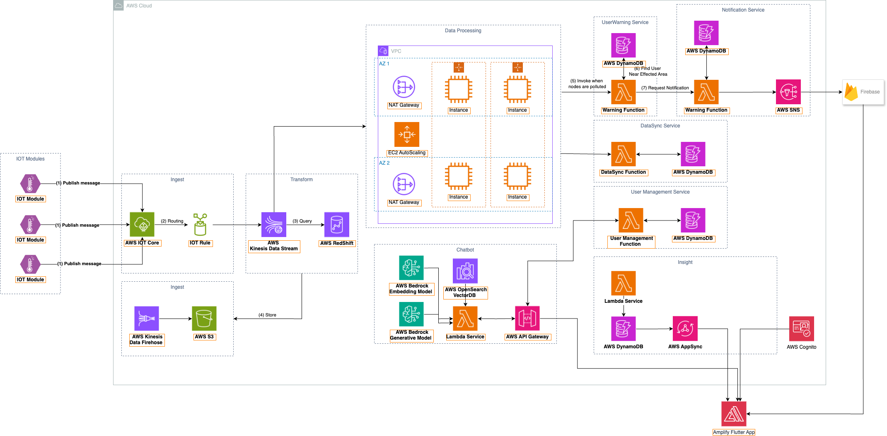
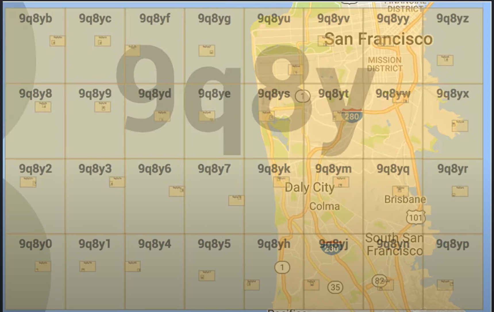
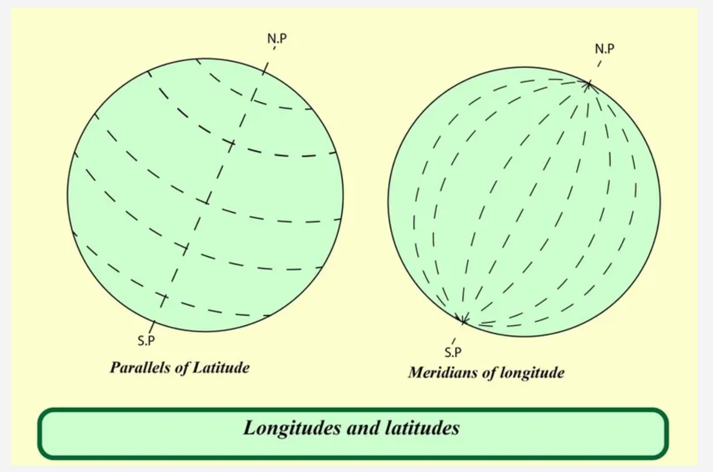
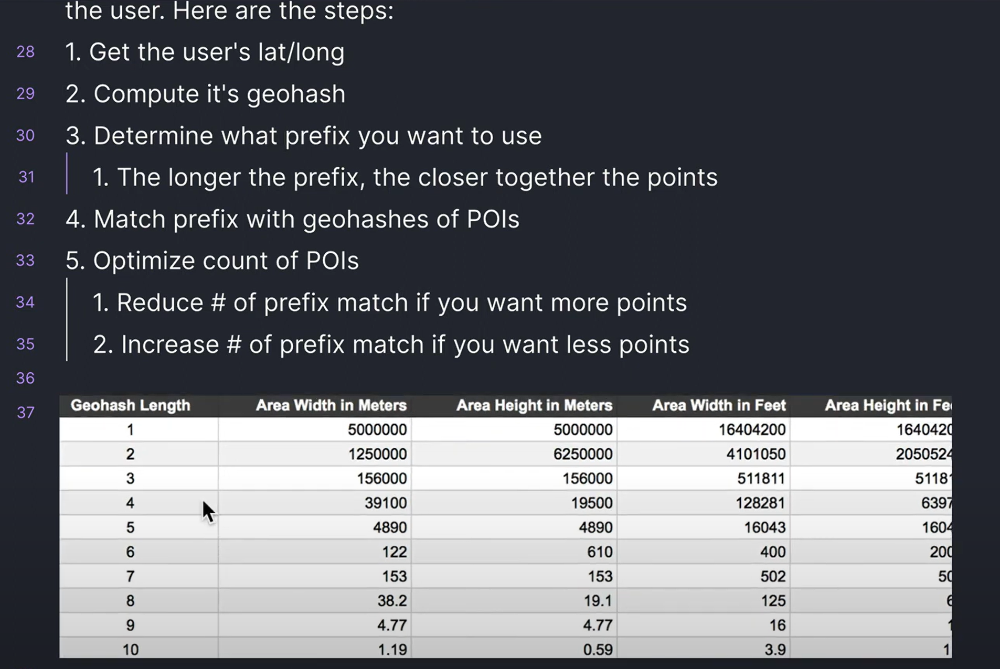
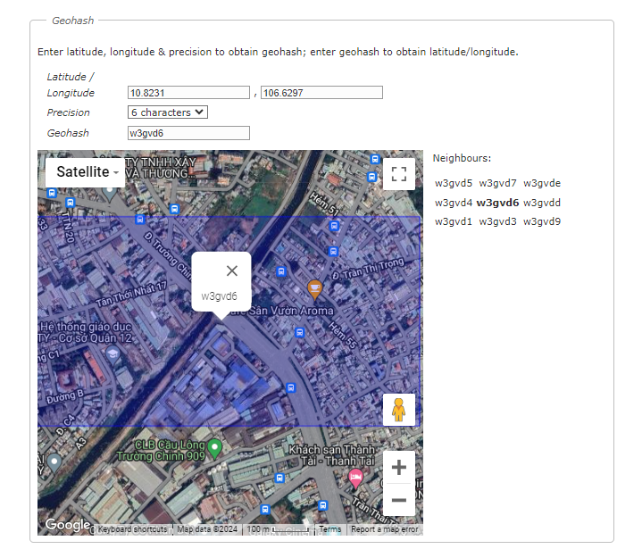
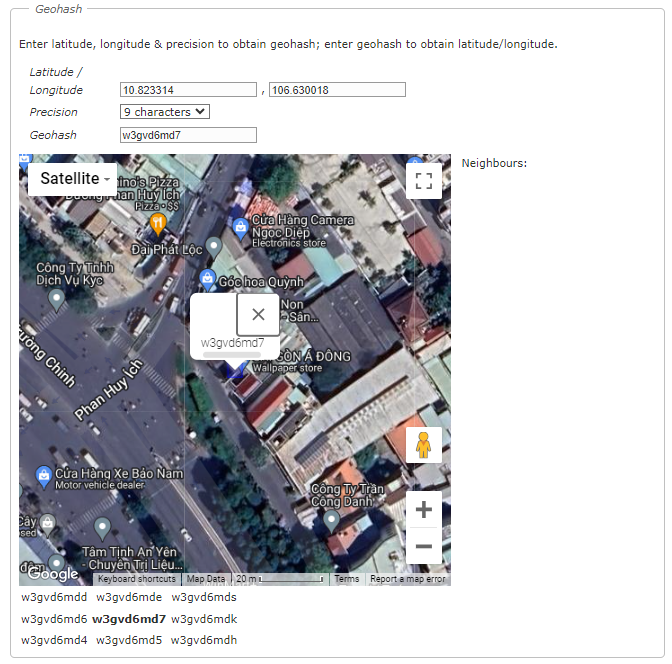

# EcoPerson Project

## Team Members

- BanhsBao, Duc, Mi, Dung.

## Overview

The EcoPerson project addresses serious environmental issues in Hồ Chí Minh City, particularly water pollution caused by illegal discharges into rivers and a lack of environmental awareness among local residents. This initiative employs IoT devices installed in rivers, alongside AWS services, to measure and monitor water quality changes. When unusual changes in water quality are detected, the system automatically sends notifications to app users within a specific radius, helping residents stay informed and take timely actions to reduce pollution. By doing so, EcoPerson contributes to raising environmental awareness and encouraging the community to protect clean water sources.

## Architecture

## Tech Stack

### IoT Devices

- **pH Sensor**: Measures the acidity or alkalinity of the water.
- **TDS Sensor**: Measures the total dissolved solids in the water, indicating its purity.
- **ESP12F**: A Wi-Fi module used to connect the IoT devices to the internet.
- **IoT Modules**: Devices deployed in rivers to measure water quality parameters.

### AWS Services

- **AWS IoT Core**: Facilitates secure communication between IoT devices and the cloud.
- **AWS IoT Rules**: Routes data from IoT devices to appropriate AWS services.
- **Amazon S3**: Stores data from IoT devices.
- **AWS Kinesis Data Streams**: Streams data for real-time processing.
- **AWS Lambda**: Executes code in response to events and automates various functions.
- **AWS DynamoDB**: A NoSQL database service used for storing user data and application metadata.
- **AWS API Gateway**: Facilitates the creation and management of APIs for the application.
- **AWS AppSync**: Provides real-time and offline functionality for the app using GraphQL.
- **AWS Cognito**: Manages user authentication and access control.
- **AWS Elastic Container Service (ECS)**: Runs containerized applications in the cloud.
- **AWS NAT Gateway**: Enables instances in a private subnet to connect to the internet.
- **Amazon CloudWatch**: Monitors and logs system metrics and application logs.
- **AWS SNS (Simple Notification Service)**: Sends notifications to users.
- **AWS SageMaker**: Builds, trains, and deploys machine learning models for data analysis.
- **AWS Bedrock**: Provides generative AI capabilities for building and scaling AI applications.

### Other Services

- **Firebase**: Push notification service for sending alerts to mobile devices.

## Outstanding Points

- **Real-Time Monitoring**: Continuous monitoring of water quality in rivers using IoT devices.
- **Automated Alerts**: Immediate notification to residents within an affected radius when pollution levels change.
- **Scalable Architecture**: Utilizes AWS services to ensure scalability, reliability, and security.
- **Machine Learning Integration**: Uses AWS SageMaker to develop models that predict and analyze pollution trends.
- **Generative AI**: Implements AWS Bedrock for advanced AI capabilities and applications.
- **User Management and Security**: Implements AWS Cognito for secure and seamless user authentication and management.
- **Comprehensive Data Handling**: Efficient data ingestion, processing, and storage using AWS IoT, Kinesis, S3, and DynamoDB.
- **Environmental Impact**: Raises awareness and encourages community actions to protect water sources.

### Find and alert users in polluted area

## Getting Started

1. **Deploy IoT Devices**: Install and configure IoT devices in the target rivers to start measuring water quality.
2. **Set Up AWS Services**: Configure the necessary AWS services as outlined in the architecture diagram.
3. **Connect IoT Devices to AWS IoT Core**: Ensure that the IoT devices can securely communicate with AWS IoT Core.
4. **Implement Data Processing Pipelines**: Set up data ingestion, processing, and storage using AWS Kinesis, Lambda, and S3.
5. **Develop and Train Machine Learning Models**: Use AWS SageMaker to build and train models for data analysis and predictions.
6. **Implement Generative AI**: Utilize AWS Bedrock to enhance AI capabilities within the application.
7. **Create Notification System**: Configure AWS SNS and Firebase to send real-time alerts to users.
8. **Deploy User-Facing Application**: Develop and deploy the user application using AWS AppSync, Cognito, and API Gateway.
