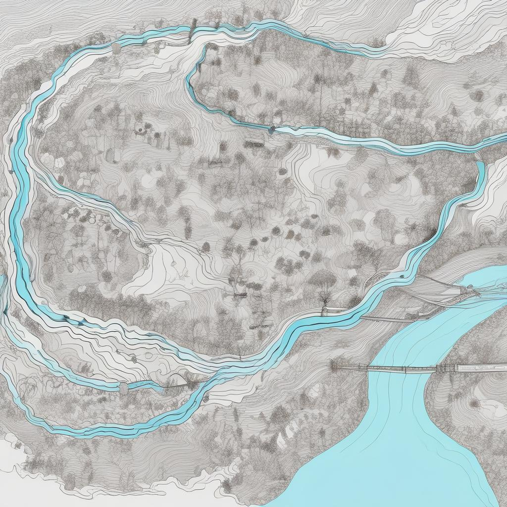

# Water Pollution Protection Project

## Team Members

- BanhsBao
- Duck
- Dun
- Mi

## Project Overview

This project aims to monitor and protect water quality using IoT devices. We have implemented a system that collects, ingests, processes, and analyzes water quality data to detect pollution and provide actionable insights.

## Architecture

### Source

- **IoT/Stream Devices**: These include various sensors like TDS and pH sensors connected to ESP8266 modules. These devices collect telemetry data related to water quality.
- **Telemetry Data**: The raw data collected by the sensors.

### Collect

- **AWS IoT Greengrass**: This service runs on edge devices to collect telemetry data from IoT devices.
- **AWS IoT**: Manages the communication between the IoT devices and the AWS cloud.

### Ingest

- **AWS IoT Core**: Receives and routes the telemetry data from AWS IoT Greengrass.
- **AWS IoT SiteWise**: Models and analyzes industrial equipment data, including water quality sensors.

### Transform

- **Amazon Kinesis Data Streams**: Streams the telemetry data for real-time processing.
- **Amazon Kinesis Data Analytics**: Performs real-time stream enrichment and anomaly detection on the data.

### Store

- **Amazon S3**: Stores the telemetry data in a data lake for batch analytics.
- **Amazon Kinesis Data Firehose**: Delivers real-time streams to Amazon S3 for long-term storage.

### Insights

- **AWS Lambda**: Processes data and triggers actions based on defined rules.
- **Amazon DynamoDB**: Stores processed data and metadata for quick access.
- **AWS AppSync**: Synchronizes data with enterprise applications.
- **Amazon SageMaker**: Performs machine learning inference for advanced analytics.
- **Amazon OpenSearch Service**: Indexes the data and provides powerful search and analytics capabilities.
- **Amazon OpenSearch Dashboard**: Visualizes the data and insights for reporting and monitoring.

## Modules Used

- **ESP8266**: A low-cost Wi-Fi microchip used in the IoT devices to send data to the cloud.
- **TDS Sensor**: Measures the Total Dissolved Solids in the water, indicating its quality.
- **pH Sensor**: Measures the acidity or alkalinity of the water, an important parameter in water quality.

## Getting Started

1. Set up the ESP8266 modules with TDS and pH sensors.
2. Configure the AWS IoT Greengrass and AWS IoT Core to collect telemetry data from the sensors.
3. Set up Amazon Kinesis Data Streams and Amazon Kinesis Data Analytics for real-time data processing.
4. Store data in Amazon S3 using Amazon Kinesis Data Firehose.
5. Process and analyze the data using AWS Lambda, Amazon SageMaker, and Amazon DynamoDB.
6. Visualize the insights using Amazon OpenSearch Service and the OpenSearch Dashboard.
7. Sync the data with enterprise applications using AWS AppSync.

## Conclusion

This project provides a comprehensive solution for monitoring and protecting water quality using IoT technology and AWS services. The architecture ensures real-time data processing, storage, and analysis to detect and respond to water pollution effectively.

## License

This project is licensed under the MIT License - see the LICENSE.md file for details.
